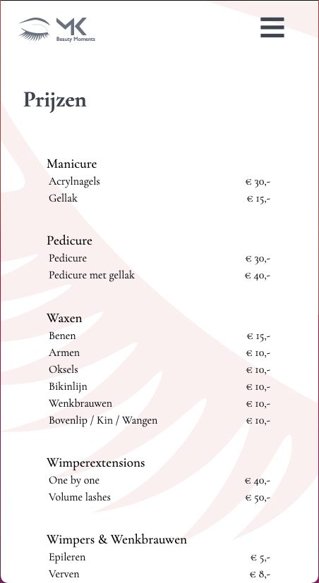
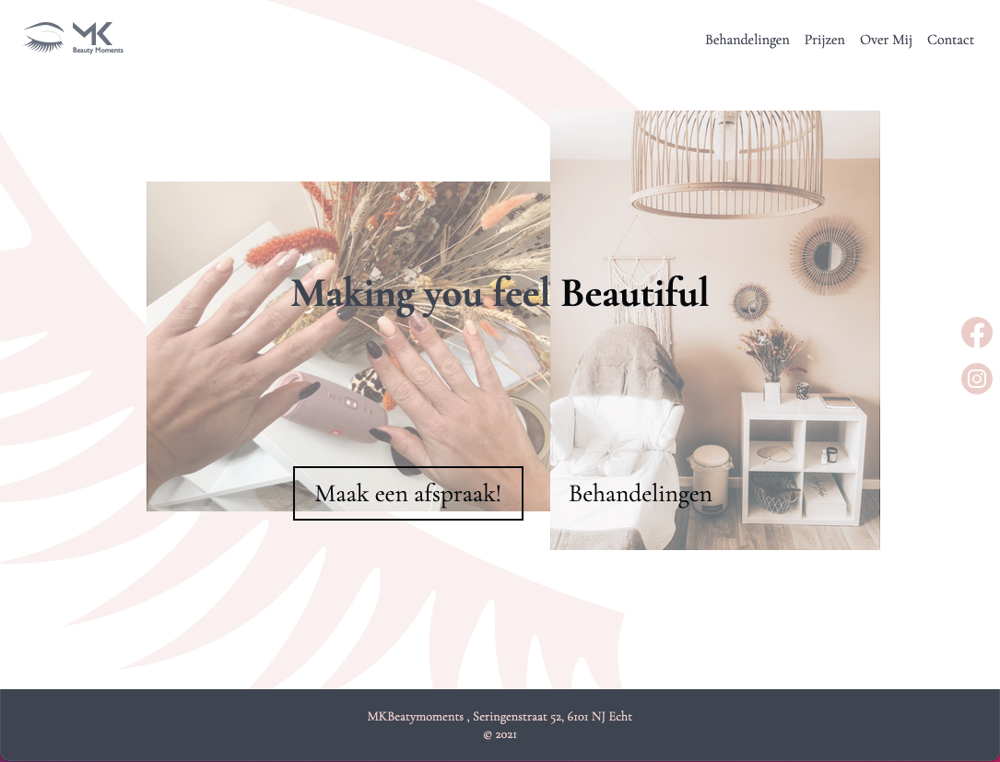

# Procesverslag
**Auteur:** Remco Kuckelkorn

Markdown cheat cheet: [Hulp bij het schrijven van Markdown](https://github.com/adam-p/markdown-here/wiki/Markdown-Cheatsheet). Nb. de standaardstructuur en de spartaanse opmaak zijn helemaal prima. Het gaat om de inhoud van je procesverslag. Besteedt de tijd voor pracht en praal aan je website.

## Bronnenlijst
1. [CSS tricks](https://css-tricks.com/)
2. [MDN web Docs](https://developer.mozilla.org)

## Eindgesprek (week 7/8)

In eerste instantie ging veel goed. Had al heel snel mijn eerste HTML opzet klaar met simpele css. Na het eerste voortgangsgesprek waren er nog wel wat opmerkingen over mijn eerste HTMl, voornamelijk de enkele div's en span's die werdeng gebruikt. Gelukkig waren die heel snel verholpen. Op mijn 2de pagina (de prijslijst) was het allemaal nog wel wat lastiger aangezien ik een website maak volledig van scratch. Hier was het vooral lastig om een goede opmaak te bedenken en die daarna dan ook om te zetten naar css. In Figma gaat alles toch net wat makkelijker. Ook waren er wat issues met de tabel met alle prijzen. Voornamelijk een titel boven de tabel zetten. Uiteindelijk is dit opgelost met een caption in de tabel te zetten. Echter is dit nog steeds niet ideaal wat betreft toegankelijkheid. Waar ik zo op kom. Daarnaast had ik ook nog moeite met de elementen die niet geschikt waren om in de HTML te zetten en meer geschikt waren om in de CSS te verwerken. Bijvoorbeeld de afbeeldingen op de index pagina die geen meerwaarde hadden behalve opmaak, het issue wat zich hier voor deed was dat ik van de 3 afbeeldingen maar 2 kon aanroepen met pseudo selectors. Ook het hamburgermenu dat alleen maar visible is op een klein scherm. Hiervoor had ik aparte buttons in de HTML gezet maar omdat dat niet ideaal is want je gebruikt ze niet altijd, is er besloten om ze weg te halen en op de ul een before element te zetten die het hamburgermenu opent. Dit heeft er wel voor gezorgd dat de hele ul toggable is i.p.v. alleen de buttons. Tenslotte de animaties, mijn idee was om als de pagina laadt de elementen in te laden als het ware door middel van delays. Echter leverde dit problemen op dat de elementen al waren ingeladen en pas na de delay de animatie uitvoerde. In de huidige situatie had ik dit opgelost daar de delays weg te halen en de animatieduur langer te maken, echter vind ik deze oplossing niet ideaal. Ik had een manier gevonden die wellicht zou kunnen werken alleen heb ik deze nog niet toegepast, deze oplossing maakt gebruik van JS en kijkt naar de wanneer de pagina klaar is met laden.  

### Toegankelijkheid 
Na het aanzetten van de voice-over op mijn macbook heb ik mijn website doorlopen. Dit ging verassend goed mijn website werd goed doorlopen. Echter had ik niet het gevoel dat ik controle had over de website met een screenreader hij las namelijk mijn hele website voor i.p.v. dat ik controle had over waar ik was met mijn ogen. Dit kan mijn onervarenheid zijn met het werken met een screenreader. De links werkten allemaal met een screenreader als ik op enter drukte. Echter was het voor mij niet helemaal duidelijk of de gebruiker ook wist dat het een link was. Ook was er een issue op de pagina met de prijzen. De captions die ik gebruik om de titel van de tabel op te lezen werden niet voorgelezen, en ook hier moest de gebruiker maar wachten tot de screenreader alle prijzen had opgelezen i.p.v. dat hij er zelf met de arrowkeys doorheen kon gaan. 

**Screenshot(s):**

> 
>
> Landingspagina in mobiele vorm

> 
>
> Werkend hamburgermenu 

> 
>
> De Prijslijst op een mobiele viewport

> 
>
> Landingspagina op Desktop

> 
>
> Prijslijst op Desktop

## Voortgang 3 (week 6)

-same as voortgang 1-

## Voortgang 2 (week 5)

### Stand van zaken

Iets minder gedaan dan bij de eerste voortgang. Vooral bij de lessen gekeken naar elementen die ik kan meenemen en de feedback grotendeels verwerkt na het eerste gesprek.

### Bespreken voor meeting

Transitions weghalen bij scalen? Netter
Table headings bug laden niet zoals de bedoeling is
3 Foto's als achtergrond alleen maar css?
## Voortgang 1 (week 3)

### Stand van zaken

Wat ging goed. Opdrachten waren relatief makkelijk te maken ook de zwarte piste opdrachten. Zelf had ik al redelijk veel van te voren al af gezien mijn opdracht. Aangezien ik al bezig was met het maken van een website en de mogelijkheid had om het bij dit vak af te maken. Het meest lastige blijft toch het blijven tweaken van de css om het helemaal naar je wens te krijgen. 

**Screenshot(s):**

> 
>
> Landingspagina in mobiele vorm in HTML & CSS al bijna af. Alleen nog lichtelijk tweaken. 

> 
>
> Werkend hamburgermenu alleen nog animaties toevoegen.

> 
>
> Landingspagina op desktop formaat. Er zitten al breakpoints in het ontwerp met mediaqueries. Hier moet ik nog iets meer aan tweaken om het helemaal naar wens te krijgen. Vooral erg aanwezig als ik de website op fullscreen heb met een flinke browser breedte

>  
>
> Prijslijst & Contactpagina bijna klaar met de HTML alleen nog een CTA toevoegen aan de prijslijst. Voor de rest nog volledig stylen met CSS.  

### Agenda voor meeting

-samen met je groepje opstellen-

| student 1      | student 2          | student 3    | student 4        |
| ---            | ---                | ---          | ---              |
| dit bespreken  | en dit             | en ik dit    | en dan ik dat    |
| an dat ook nog | dit als er tijd is | nog een punt | dit wil ik zeker |
| ...            | ...                | ...          | ...              |

### Verslag van meeting

Denk aan de tags bij adres enzo ipv paragrafen. maak email en telefoonnummer klikbaar. Kijk of je naar de plaatjes kunt kijken die niet relevant zijn voor de inhoud om die op een andere manier weer te geven in de css, vooral op de index pagina. Table headings voor de prijsinformatie om dat nog netter te maken. Kijk nog een keer naar de styling of het niet nog netter kan. Kijk of je display grid en flex kunt combineren om het nog strakker te maken. Bij de navigatie zijn de verschillende buttons niet nodig, probeer het klikbaar te maken met javascript. Dit is vooral handig omdat de buttons niet nodig zijn op een desktop display dus dan hoeven ze ook niet te worden ingeladen als HTML zijnde.

## Breakdownschets (week 1)

-uitwerken voor de 1e werkgroep - eind van de eerste week-

## Intake (week 1)
-uitwerken voor de kick-off werkgroep - begin van de eerste week-

**Je startniveau:** - Tussen rood en zwart 

**Je focus:** - Grootste focus op surface

**Je opdracht:** - Website maken voor een bedrijf van me zusje voor een schoonheidssalon. Website bestaat uit meerdere pagina's. 
Focus ligt op de landing page en de pagina met alle behandelingen. Mocht alles goed verlopen dan kunnen de overige pagina's zoals de about me, contact en prijslijst ook worden meegenomen.
Uitdagingen liggen bij de vormgeving op verschillende grootes van schermen en de JS. 

**Screenshot(s) van de eerste pagina (small screen):**

**Screenshot(s) van de tweede pagina (small screen):**

